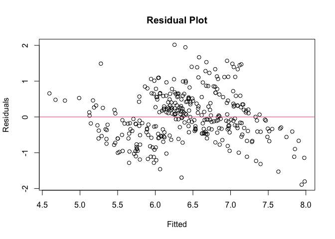
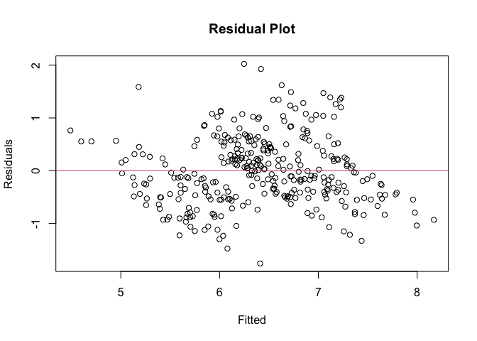

Analyzing High-risk Factors in Vehicle Accident Fatalities
================
Young Han
2024-12-07

## Project Objective:

Using the Fatalities dataset in R, this project demonstrates a
step-by-step process for the diagnostic analysis and validation of a
multiple linear regression model. The primary goal is not on predictive
accuracy, but on the application of statistical tests to validate model
assumptions and refine the model based on that evidence.

### Load libraries

``` r
################################################################################
# External Functions
################################################################################
library(faraway)
library(smallstuff)
library(broom)
library(sur)
library(AER)
```

    ## Loading required package: car

    ## Loading required package: carData

    ## 
    ## Attaching package: 'carData'

    ## The following objects are masked from 'package:sur':
    ## 
    ##     Anscombe, States

    ## 
    ## Attaching package: 'car'

    ## The following objects are masked from 'package:faraway':
    ## 
    ##     logit, vif

    ## Loading required package: lmtest

    ## Loading required package: zoo

    ## 
    ## Attaching package: 'zoo'

    ## The following objects are masked from 'package:base':
    ## 
    ##     as.Date, as.Date.numeric

    ## Loading required package: sandwich

    ## Loading required package: survival

    ## 
    ## Attaching package: 'survival'

    ## The following objects are masked from 'package:faraway':
    ## 
    ##     rats, solder

``` r
################################################################################
# Internal Functions
################################################################################

################################################################################
# Save the environment 
################################################################################
parSave=par(no.readonly = TRUE)
#par(parSave)
################################################################################
# Processing 
################################################################################
```

## Load data and conduct simple data check

``` r
data("Fatalities")
summary(Fatalities)
```

``` r
print('Dataset Dimension:')
```

    ## [1] "Dataset Dimension:"

``` r
paste0('Rows: ', nrow(Fatalities),', ', 'Columns: ', ncol(Fatalities))
```

    ## [1] "Rows: 336, Columns: 34"

**Pre-selected predictors**

``` r
head(Fatalities[c('unemp','income','spirits','beertax')], 3)
```

    ##   unemp   income spirits  beertax
    ## 1  14.4 10544.15    1.37 1.539379
    ## 2  13.7 10732.80    1.36 1.788991
    ## 3  11.1 11108.79    1.32 1.714286

**Check missing values**

``` r
sum(is.na(Fatalities))
```

    ## [1] 2

``` r
which(!complete.cases(Fatalities))
```

    ## [1] 28

- There are 2 missing values in the dataset. Both are on 28th
  observation
- One NA in jail variable
- One NA in service variable
- We decided to omit a row with missing values

``` r
Fatalities=na.omit(Fatalities)
print('Dataset Dimension after omitting NAs:')
```

    ## [1] "Dataset Dimension after omitting NAs:"

``` r
paste0('Rows: ', nrow(Fatalities),', ', 'Columns: ', ncol(Fatalities))
```

    ## [1] "Rows: 335, Columns: 34"

## Perform linear regression on dataset with pre-selected predictors

**First model**

``` r
lmod1=lm(fatal~unemp+income+spirits+beertax+miles,Fatalities)
summary(lmod1)
```

    ## 
    ## Call:
    ## lm(formula = fatal ~ unemp + income + spirits + beertax + miles, 
    ##     data = Fatalities)
    ## 
    ## Residuals:
    ##     Min      1Q  Median      3Q     Max 
    ## -1788.5  -404.5  -161.0   164.4  3964.1 
    ## 
    ## Coefficients:
    ##               Estimate Std. Error t value Pr(>|t|)    
    ## (Intercept) -3.369e+03  6.374e+02  -5.286 2.28e-07 ***
    ## unemp        1.375e+02  2.268e+01   6.064 3.64e-09 ***
    ## income       2.729e-01  2.896e-02   9.423  < 2e-16 ***
    ## spirits     -3.788e+02  7.166e+01  -5.285 2.29e-07 ***
    ## beertax      5.482e+02  1.019e+02   5.379 1.43e-07 ***
    ## miles       -1.628e-02  3.202e-02  -0.509    0.611    
    ## ---
    ## Signif. codes:  0 '***' 0.001 '**' 0.01 '*' 0.05 '.' 0.1 ' ' 1
    ## 
    ## Residual standard error: 792.9 on 329 degrees of freedom
    ## Multiple R-squared:  0.2405, Adjusted R-squared:  0.2289 
    ## F-statistic: 20.83 on 5 and 329 DF,  p-value: < 2.2e-16

``` r
coef(lmod1)
```

    ##   (Intercept)         unemp        income       spirits       beertax 
    ## -3.369355e+03  1.375499e+02  2.728648e-01 -3.787741e+02  5.481875e+02 
    ##         miles 
    ## -1.628453e-02

**Check residual plot**

``` r
plot(residuals(lmod1)~fitted(lmod1),
     xlab='Fitted',
     ylab = 'Residuals',
     main='Residual Plot')
abline(h=0,col=2)
```

<!-- -->

- Clearly shows funnel shape indicating heteroscedasticity

**Check p-value and Q-Q plot**

``` r
summary(lm(sqrt(abs(residuals(lmod1)))~fitted(lmod1)))
```

    ## 
    ## Call:
    ## lm(formula = sqrt(abs(residuals(lmod1))) ~ fitted(lmod1))
    ## 
    ## Residuals:
    ##     Min      1Q  Median      3Q     Max 
    ## -25.540  -5.629  -0.726   4.000  38.582 
    ## 
    ## Coefficients:
    ##               Estimate Std. Error t value Pr(>|t|)    
    ## (Intercept)   9.584016   1.211794   7.909 3.86e-14 ***
    ## fitted(lmod1) 0.010475   0.001192   8.787  < 2e-16 ***
    ## ---
    ## Signif. codes:  0 '***' 0.001 '**' 0.01 '*' 0.05 '.' 0.1 ' ' 1
    ## 
    ## Residual standard error: 9.647 on 333 degrees of freedom
    ## Multiple R-squared:  0.1882, Adjusted R-squared:  0.1858 
    ## F-statistic: 77.22 on 1 and 333 DF,  p-value: < 2.2e-16

``` r
glance(lmod1)$p.value
```

    ##        value 
    ## 4.355665e-18

``` r
qqnorm(resid(lmod1));qqline(resid(lmod1))
```

<!-- -->

- p-value is too small (4.36e-18 \< 0.05). We reject the null hypothesis
  of homoscedasticity
- Also, qqplot shows long tailed distribution.

**Conduct Shapiro test to confirm**

``` r
shapiro.test(residuals(lmod1))
```

    ## 
    ##  Shapiro-Wilk normality test
    ## 
    ## data:  residuals(lmod1)
    ## W = 0.74616, p-value < 2.2e-16

``` r
glance(shapiro.test(residuals(lmod1)))$p.value
```

    ## [1] 2.511591e-22

- p-value is too small (2.51e-22\<0.05). reject null hypothesis of
  normality.
- We reject first model and move on to the next model.

**Second model: Apply transformation to the response and remove a
predictor**

``` r
lmod2=update(lmod1,log(fatal)~.-miles)
summary(lmod2)
```

    ## 
    ## Call:
    ## lm(formula = log(fatal) ~ unemp + income + spirits + beertax, 
    ##     data = Fatalities)
    ## 
    ## Residuals:
    ##      Min       1Q   Median       3Q      Max 
    ## -1.89178 -0.43956 -0.05307  0.42836  2.01616 
    ## 
    ## Coefficients:
    ##               Estimate Std. Error t value Pr(>|t|)    
    ## (Intercept)  4.823e-01  4.214e-01   1.145    0.253    
    ## unemp        2.157e-01  1.801e-02  11.979   <2e-16 ***
    ## income       3.597e-04  2.417e-05  14.884   <2e-16 ***
    ## spirits     -6.099e-01  6.134e-02  -9.944   <2e-16 ***
    ## beertax      8.439e-01  8.717e-02   9.681   <2e-16 ***
    ## ---
    ## Signif. codes:  0 '***' 0.001 '**' 0.01 '*' 0.05 '.' 0.1 ' ' 1
    ## 
    ## Residual standard error: 0.6788 on 330 degrees of freedom
    ## Multiple R-squared:  0.4677, Adjusted R-squared:  0.4612 
    ## F-statistic: 72.48 on 4 and 330 DF,  p-value: < 2.2e-16

``` r
coef(lmod2)
```

    ##   (Intercept)         unemp        income       spirits       beertax 
    ##  0.4823109192  0.2157306892  0.0003596782 -0.6099133211  0.8439066021

**Check residual plot**

``` r
plot(residuals(lmod2)~fitted(lmod2),
     xlab='Fitted',
     ylab = 'Residuals',
     main='Residual Plot')
abline(h=0,col=2)
```

<!-- -->

- No funnel shape shown

**Check p-value and Q-Q plot**

``` r
summary(lm(sqrt(abs(residuals(lmod2)))~fitted(lmod2)))
```

    ## 
    ## Call:
    ## lm(formula = sqrt(abs(residuals(lmod2))) ~ fitted(lmod2))
    ## 
    ## Residuals:
    ##      Min       1Q   Median       3Q      Max 
    ## -0.64452 -0.19741 -0.01515  0.18182  0.74316 
    ## 
    ## Coefficients:
    ##               Estimate Std. Error t value Pr(>|t|)    
    ## (Intercept)    0.66781    0.15673   4.261 2.65e-05 ***
    ## fitted(lmod2)  0.00143    0.02429   0.059    0.953    
    ## ---
    ## Signif. codes:  0 '***' 0.001 '**' 0.01 '*' 0.05 '.' 0.1 ' ' 1
    ## 
    ## Residual standard error: 0.2807 on 333 degrees of freedom
    ## Multiple R-squared:  1.04e-05,   Adjusted R-squared:  -0.002993 
    ## F-statistic: 0.003465 on 1 and 333 DF,  p-value: 0.9531

``` r
qqnorm(resid(lmod2));qqline(resid(lmod2))
```

<!-- -->

- p-value is 0.953\>0.05. We retain the null hypothesis of
  homoscedasticity.
- Residuals normally distributed

**Conduct Shapiro test to confirm**

``` r
shapiro.test(residuals(lmod2))
```

    ## 
    ##  Shapiro-Wilk normality test
    ## 
    ## data:  residuals(lmod2)
    ## W = 0.99591, p-value = 0.5363

- p-value is 0.536\>0.05. We retain the null hypothesis of normality and
  conclude that the residuals are normally distributed.

## Check presence of leverages, outliers, and influential points

**High leverages**

``` r
hatv=hatvalues(lmod2)
hi=hatv[hatv>2*mean(hatv)]
paste0('Number of high leverages: ', length(hi))
```

    ## [1] "Number of high leverages: 33"

**Plot highlighting 4 highest leverages**

``` r
hiorder=names(hi[order(hi,decreasing = T)[1:4]])
halfnorm(hatv,4,ylab='Leverages');qqlineHalf(hatv)
```

<!-- -->

``` r
Fatalities[hiorder,c('state','unemp','income','spirits','beertax')]
```

    ##     state unemp   income spirits   beertax
    ## 176    nv  10.1 14914.08    4.90 0.1610979
    ## 177    nv   9.8 14863.53    4.75 0.1999713
    ## 57     ga   7.8 11774.46    1.94 2.7207637
    ## 183    nh   7.4 13834.13    4.57 0.4832936

- States with high spirits consumption (Nevada and New Hampshire) and a
  state with high beertax (Georgia) seem to have extreme predictor
  values

**New model without high leverages**

``` r
idx2=as.numeric(names(hi))
lmod3=update(lmod2,subset=-idx2)
```

``` r
summary(lmod2)
```

    ## 
    ## Call:
    ## lm(formula = log(fatal) ~ unemp + income + spirits + beertax, 
    ##     data = Fatalities)
    ## 
    ## Residuals:
    ##      Min       1Q   Median       3Q      Max 
    ## -1.89178 -0.43956 -0.05307  0.42836  2.01616 
    ## 
    ## Coefficients:
    ##               Estimate Std. Error t value Pr(>|t|)    
    ## (Intercept)  4.823e-01  4.214e-01   1.145    0.253    
    ## unemp        2.157e-01  1.801e-02  11.979   <2e-16 ***
    ## income       3.597e-04  2.417e-05  14.884   <2e-16 ***
    ## spirits     -6.099e-01  6.134e-02  -9.944   <2e-16 ***
    ## beertax      8.439e-01  8.717e-02   9.681   <2e-16 ***
    ## ---
    ## Signif. codes:  0 '***' 0.001 '**' 0.01 '*' 0.05 '.' 0.1 ' ' 1
    ## 
    ## Residual standard error: 0.6788 on 330 degrees of freedom
    ## Multiple R-squared:  0.4677, Adjusted R-squared:  0.4612 
    ## F-statistic: 72.48 on 4 and 330 DF,  p-value: < 2.2e-16

``` r
summary(lmod3)
```

    ## 
    ## Call:
    ## lm(formula = log(fatal) ~ unemp + income + spirits + beertax, 
    ##     data = Fatalities, subset = -idx2)
    ## 
    ## Residuals:
    ##      Min       1Q   Median       3Q      Max 
    ## -2.16722 -0.48300 -0.05943  0.42556  1.99876 
    ## 
    ## Coefficients:
    ##               Estimate Std. Error t value Pr(>|t|)    
    ## (Intercept) -4.196e-01  4.599e-01  -0.912    0.362    
    ## unemp        2.473e-01  1.944e-02  12.722  < 2e-16 ***
    ## income       4.235e-04  2.729e-05  15.516  < 2e-16 ***
    ## spirits     -7.844e-01  9.659e-02  -8.121 1.25e-14 ***
    ## beertax      1.071e+00  1.145e-01   9.354  < 2e-16 ***
    ## ---
    ## Signif. codes:  0 '***' 0.001 '**' 0.01 '*' 0.05 '.' 0.1 ' ' 1
    ## 
    ## Residual standard error: 0.6702 on 297 degrees of freedom
    ## Multiple R-squared:  0.4858, Adjusted R-squared:  0.4789 
    ## F-statistic: 70.15 on 4 and 297 DF,  p-value: < 2.2e-16

- Not much difference after removing high leverages
- We decided to continue working with our second model, lmod2 (lmod2:
  R-squared: 46.8%, RSE: 0.679, lmod3: R-squared: 48.6%, RSE: 0.670)

**Outliers**

``` r
out=rstudent(lmod2)[abs(rstudent(lmod2))>3]
Fatalities[282,c('state','unemp','income','spirits','beertax')]
```

    ##     state unemp   income spirits   beertax
    ## 283    tx   5.9 14039.56    1.48 0.4188462

- Only 1 outlier detected

**New model without outlier**

``` r
idx3=order(abs(rstudent(lmod2)),decreasing = T)[1]
lmod4=update(lmod2,subset=-idx3)
```

``` r
summary(lmod2)
```

    ## 
    ## Call:
    ## lm(formula = log(fatal) ~ unemp + income + spirits + beertax, 
    ##     data = Fatalities)
    ## 
    ## Residuals:
    ##      Min       1Q   Median       3Q      Max 
    ## -1.89178 -0.43956 -0.05307  0.42836  2.01616 
    ## 
    ## Coefficients:
    ##               Estimate Std. Error t value Pr(>|t|)    
    ## (Intercept)  4.823e-01  4.214e-01   1.145    0.253    
    ## unemp        2.157e-01  1.801e-02  11.979   <2e-16 ***
    ## income       3.597e-04  2.417e-05  14.884   <2e-16 ***
    ## spirits     -6.099e-01  6.134e-02  -9.944   <2e-16 ***
    ## beertax      8.439e-01  8.717e-02   9.681   <2e-16 ***
    ## ---
    ## Signif. codes:  0 '***' 0.001 '**' 0.01 '*' 0.05 '.' 0.1 ' ' 1
    ## 
    ## Residual standard error: 0.6788 on 330 degrees of freedom
    ## Multiple R-squared:  0.4677, Adjusted R-squared:  0.4612 
    ## F-statistic: 72.48 on 4 and 330 DF,  p-value: < 2.2e-16

``` r
summary(lmod4)
```

    ## 
    ## Call:
    ## lm(formula = log(fatal) ~ unemp + income + spirits + beertax, 
    ##     data = Fatalities, subset = -idx3)
    ## 
    ## Residuals:
    ##      Min       1Q   Median       3Q      Max 
    ## -1.90043 -0.43420 -0.04581  0.43184  1.95416 
    ## 
    ## Coefficients:
    ##               Estimate Std. Error t value Pr(>|t|)    
    ## (Intercept)  4.416e-01  4.165e-01   1.060     0.29    
    ## unemp        2.177e-01  1.780e-02  12.228   <2e-16 ***
    ## income       3.604e-04  2.388e-05  15.095   <2e-16 ***
    ## spirits     -6.055e-01  6.062e-02  -9.989   <2e-16 ***
    ## beertax      8.478e-01  8.613e-02   9.844   <2e-16 ***
    ## ---
    ## Signif. codes:  0 '***' 0.001 '**' 0.01 '*' 0.05 '.' 0.1 ' ' 1
    ## 
    ## Residual standard error: 0.6706 on 329 degrees of freedom
    ## Multiple R-squared:  0.4757, Adjusted R-squared:  0.4693 
    ## F-statistic: 74.61 on 4 and 329 DF,  p-value: < 2.2e-16

- Again, not much difference after taking out an outlier
- We decided to continue working with our second model, lmod2 (lmod2:
  R-squared: 46.8%, RSE: 0.679, lmod4: R-squared: 47.6%, RSE: 0.671)

**Influential observations**

``` r
cook=cooks.distance(lmod2)
idx4=order(cook,decreasing = T)[1:6]
cook[idx4]
```

    ##        317         42         41          2        318          1 
    ## 0.10521070 0.08416166 0.04370496 0.02845280 0.02598846 0.02422270

- All of them are exhibit very low scores (less than 0.5)

``` r
plot(cook,ylab = "Cook's Distance",
     main = "Cook's Distance vs. Index")
unname(cook[idx4])
```

    ## [1] 0.10521070 0.08416166 0.04370496 0.02845280 0.02598846 0.02422270

``` r
points(idx4,unname(cook[idx4]),pch=16,col=3)
```

<!-- -->

``` r
halfnorm(cook,6,ylab = "Cook's Distance",
         main="Cook's Distance vs. Half-normal Quantiles")
qqlineHalf(cook)
```

<!-- -->

- Several points look apart from the others
- We decided to try a new model without 6 highest influential
  observations

**New model without influential observations**

``` r
lmod5=update(lmod2,subset=-idx4)
```

``` r
summary(lmod2) # R2: 46.8%, RSE: 0.679
```

    ## 
    ## Call:
    ## lm(formula = log(fatal) ~ unemp + income + spirits + beertax, 
    ##     data = Fatalities)
    ## 
    ## Residuals:
    ##      Min       1Q   Median       3Q      Max 
    ## -1.89178 -0.43956 -0.05307  0.42836  2.01616 
    ## 
    ## Coefficients:
    ##               Estimate Std. Error t value Pr(>|t|)    
    ## (Intercept)  4.823e-01  4.214e-01   1.145    0.253    
    ## unemp        2.157e-01  1.801e-02  11.979   <2e-16 ***
    ## income       3.597e-04  2.417e-05  14.884   <2e-16 ***
    ## spirits     -6.099e-01  6.134e-02  -9.944   <2e-16 ***
    ## beertax      8.439e-01  8.717e-02   9.681   <2e-16 ***
    ## ---
    ## Signif. codes:  0 '***' 0.001 '**' 0.01 '*' 0.05 '.' 0.1 ' ' 1
    ## 
    ## Residual standard error: 0.6788 on 330 degrees of freedom
    ## Multiple R-squared:  0.4677, Adjusted R-squared:  0.4612 
    ## F-statistic: 72.48 on 4 and 330 DF,  p-value: < 2.2e-16

``` r
summary(lmod5) # R2: 52.0%, RSE: 0.650
```

    ## 
    ## Call:
    ## lm(formula = log(fatal) ~ unemp + income + spirits + beertax, 
    ##     data = Fatalities, subset = -idx4)
    ## 
    ## Residuals:
    ##      Min       1Q   Median       3Q      Max 
    ## -1.75710 -0.45989 -0.05773  0.42940  2.02359 
    ## 
    ## Coefficients:
    ##               Estimate Std. Error t value Pr(>|t|)    
    ## (Intercept) -1.918e-01  4.200e-01  -0.457    0.648    
    ## unemp        2.475e-01  1.836e-02  13.483   <2e-16 ***
    ## income       3.954e-04  2.415e-05  16.376   <2e-16 ***
    ## spirits     -6.469e-01  5.911e-02 -10.943   <2e-16 ***
    ## beertax      9.203e-01  8.555e-02  10.757   <2e-16 ***
    ## ---
    ## Signif. codes:  0 '***' 0.001 '**' 0.01 '*' 0.05 '.' 0.1 ' ' 1
    ## 
    ## Residual standard error: 0.6499 on 324 degrees of freedom
    ## Multiple R-squared:  0.5196, Adjusted R-squared:  0.5137 
    ## F-statistic: 87.62 on 4 and 324 DF,  p-value: < 2.2e-16

- Slightly better result by removing 6 highest influential observations
  (lmod2: R-squared: 46.8%, RSE: 0.679, lmod5: R-squared: 52.0%, RSE:
  0.650)

**Check final model (lmod5)**

``` r
plot(residuals(lmod5)~fitted(lmod5),
     xlab='Fitted',
     ylab = 'Residuals',
     main='Residual Plot')
abline(h=0,col=2)
```

<!-- -->

- No clear pattern visible indicating possible homoscedasticity

**Check p-value and Q-Q plot**

``` r
summary(lm(sqrt(abs(residuals(lmod5)))~fitted(lmod5)))
```

    ## 
    ## Call:
    ## lm(formula = sqrt(abs(residuals(lmod5))) ~ fitted(lmod5))
    ## 
    ## Residuals:
    ##      Min       1Q   Median       3Q      Max 
    ## -0.59733 -0.20635  0.00434  0.19248  0.75579 
    ## 
    ## Coefficients:
    ##                 Estimate Std. Error t value Pr(>|t|)    
    ## (Intercept)    0.6681784  0.1445463   4.623 5.46e-06 ***
    ## fitted(lmod5) -0.0002299  0.0223839  -0.010    0.992    
    ## ---
    ## Signif. codes:  0 '***' 0.001 '**' 0.01 '*' 0.05 '.' 0.1 ' ' 1
    ## 
    ## Residual standard error: 0.2724 on 327 degrees of freedom
    ## Multiple R-squared:  3.225e-07,  Adjusted R-squared:  -0.003058 
    ## F-statistic: 0.0001054 on 1 and 327 DF,  p-value: 0.9918

``` r
qqnorm(resid(lmod5));qqline(resid(lmod5))
```

<!-- -->

- p-value is 0.992\>0.05. We retain the null hypothesis of
  homoscedasticity the final model

**Conduct Shapiro test to confirm**

``` r
shapiro.test(residuals(lmod5))
```

    ## 
    ##  Shapiro-Wilk normality test
    ## 
    ## data:  residuals(lmod5)
    ## W = 0.99167, p-value = 0.06107

- p-value is 0.0611\>0.05. We retain the null hypothesis of normality
  and conclude that the residuals are normally distributed

## Check Collinearity

``` r
X_1=model.matrix(lmod5)[,-1]
cor(X_1)
```

    ##               unemp     income     spirits     beertax
    ## unemp    1.00000000 -0.5256411 -0.21368846  0.01477954
    ## income  -0.52564113  1.0000000  0.45105924 -0.38957110
    ## spirits -0.21368846  0.4510592  1.00000000 -0.08224157
    ## beertax  0.01477954 -0.3895711 -0.08224157  1.00000000

- No significantly strong correlation in the model

``` r
vif(lmod5)
```

    ##    unemp   income  spirits  beertax 
    ## 1.473528 2.094286 1.276557 1.272454

- Low VIFs for all predictors (all \< 5)

## Conclusion with synthetic dataset

**Make prediction on synthetic dataset with the best model**

``` r
(synthetic_data=data.frame(unemp=c(4.5,4.5,4.5,9),
                           income=c(14000,20000,14000,14000),
                           spirits=c(2.5,2.5,4.5,2.5),
                           beertax=c(.25,.15,.15,.15)))
```

    ##   unemp income spirits beertax
    ## 1   4.5  14000     2.5    0.25
    ## 2   4.5  20000     2.5    0.15
    ## 3   4.5  14000     4.5    0.15
    ## 4   9.0  14000     2.5    0.15

``` r
pred2=predict(lmod5,synthetic_data,interval = 'pred')
```

``` r
exp(pred2[1,])
```

    ##       fit       lwr       upr 
    ## 159.31207  43.88913 578.28296

- For the first observation the 95% PI is (44, 578) and the fitted value
  is 159. We are 95% confident that the states with a 4.5% unemployment,
  \$14,000 income per person, 2.5% spirits consumption, and 0.25% tax on
  case of beer will have a total number of vehicle fatalities between 44
  and 578.

``` r
exp(pred2[2,])
```

    ##       fit       lwr       upr 
    ## 1558.3658  425.8696 5702.4587

- For the second observation, the 95% PI is (426, 5702) and the fitted
  value is 1558. We are 95% confident that the states with a 4.5%
  unemployment, \$20,000 income per person, 2.5% spirits consumption,
  and 0.15% tax on case of beer will have a total number of vehicle
  fatalities between 63 and 5439.

``` r
exp(pred2[3,])
```

    ##       fit       lwr       upr 
    ##  39.84931  10.55812 150.40242

- For the second observation, the 95% PI is (11, 150) and the fitted
  value is 40. We are 95% confident that the states with a 4.5%
  unemployment, \$14,000 income per person, 4.5% spirits consumption,
  and 0.15% tax on case of beer will have a total number of vehicle
  fatalities between 11 and 150.

``` r
exp(pred2[4,])
```

    ##       fit       lwr       upr 
    ##  442.5980  122.3496 1601.0924

- For the second observation, the 95% PI is (122, 1601) and the fitted
  value is 443. We are 95% confident that the states with a 9.0%
  unemployment, \$14,000 income per person, 2.5% spirits consumption,
  and 0.15% tax on case of beer will have a total number of vehicle
  fatalities between 122 and 1601.
